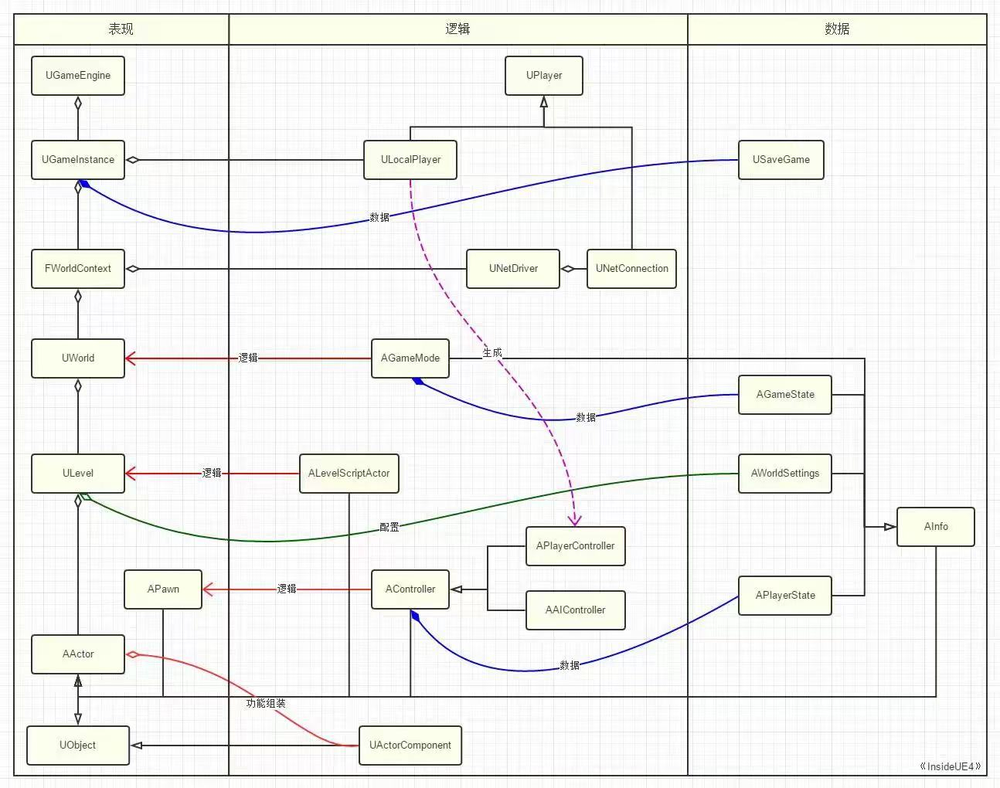
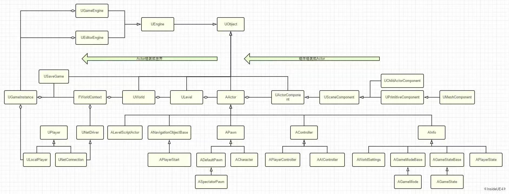
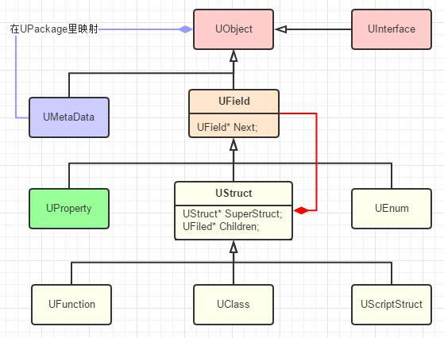
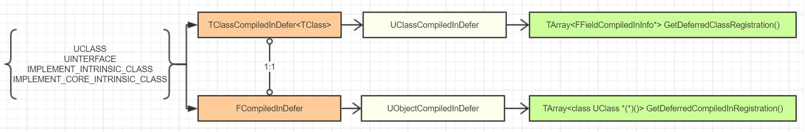
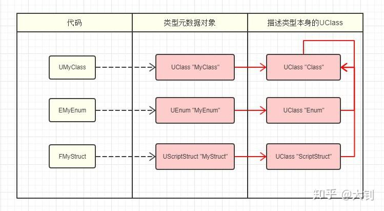
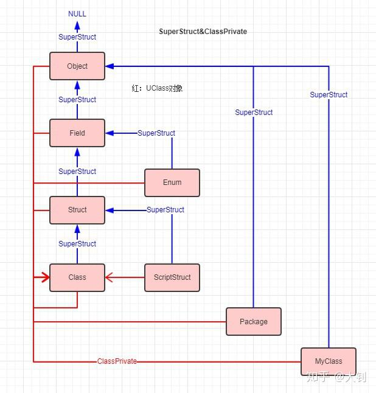
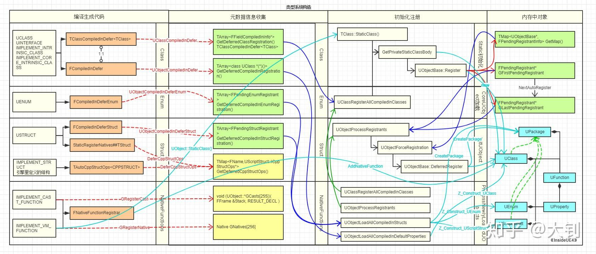
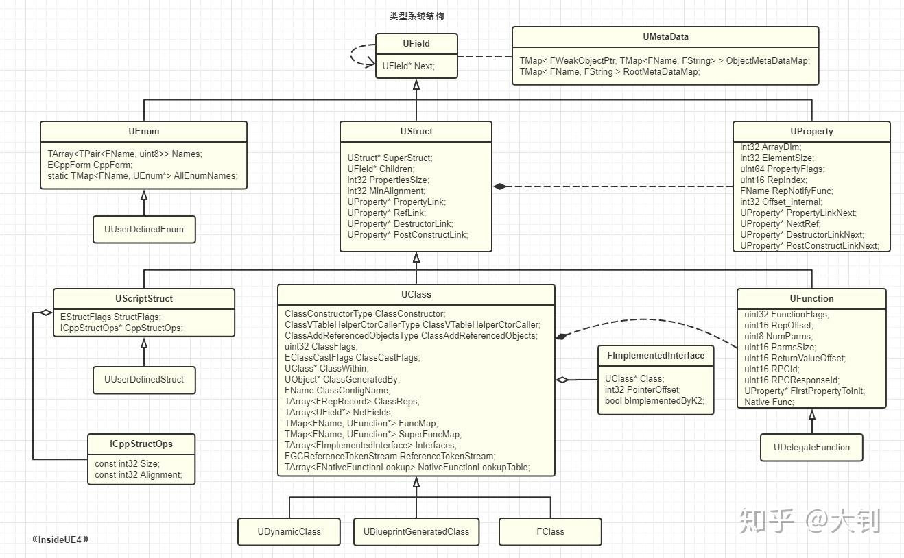
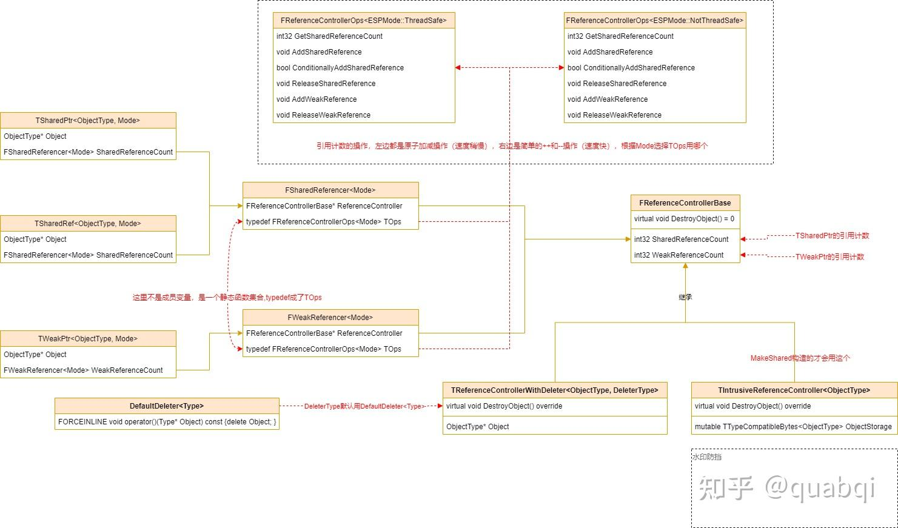

## Gameplay

Gameplay - 1

Gameplay - 2

## UObject

UObject - 1

UObject - 2
  
UObject - 3
  
UObject - 4
  
UObject - 5
  
UObject - 6

1. 大部分是不言自明的，从左到右是类型信息的收集和消费过程。从上到下是依据代码的执行顺序。
2. 红色箭头代表数据的产生添加，蓝色箭头代表数据的消费使用。这二者一起表达了类型信息的数据流向。
3. 浅蓝色箭头和矩形，代表内存中 UClass \* 以及类型对象的创建和构造
4. 信息收集里黄色的 3 个矩形，代表它们的数据会一直在内存中，用来做查找用，不会被清空.

UObject - 7
  
UObject - 8

## 智能指针

### 共享指针

