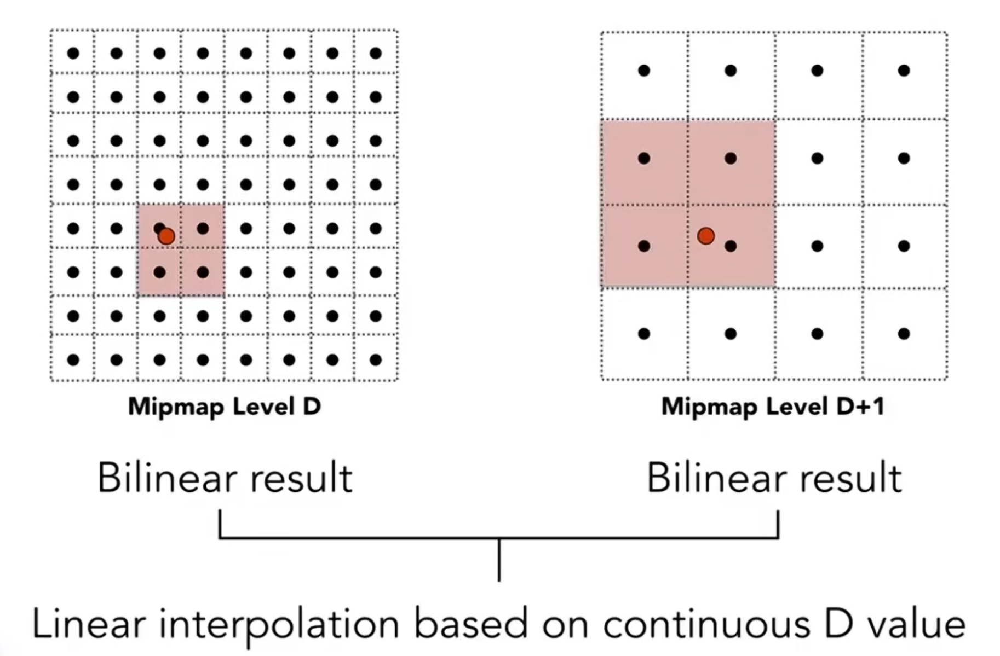

## GAMES101

### 纹理映射

1. 双线性插值：解决纹理过小（像素相对于纹素过小）时锯齿问题
2. MipMap: 解决远处纹理走样（像素相对于纹素过大）问题

二者结合：

改进：

1. 各向异性过滤：解决 mipmap 只用正方形查询的问题
2. EWA 过滤

### 光线追踪

#### 加速结构

1. 空间划分（Spatial Subdivision）

   - 八叉树（Octree）
   - KD 树（KD-Tree）
   - BSP 树（BSP-Tree）

   不好解决的两个问题：
    1. 三角形和节点（AABB）求交
    2. 三角形跨节点

2. BVH（Bounding Volume Hierarchy）
