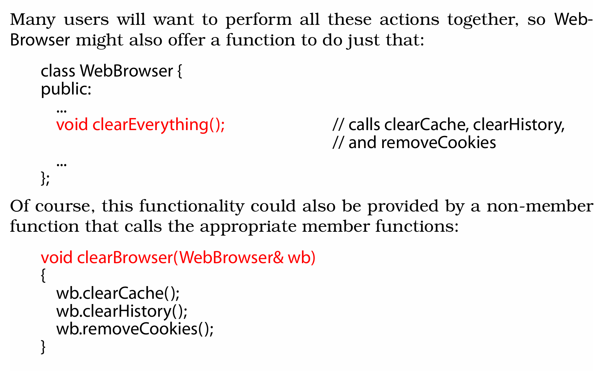
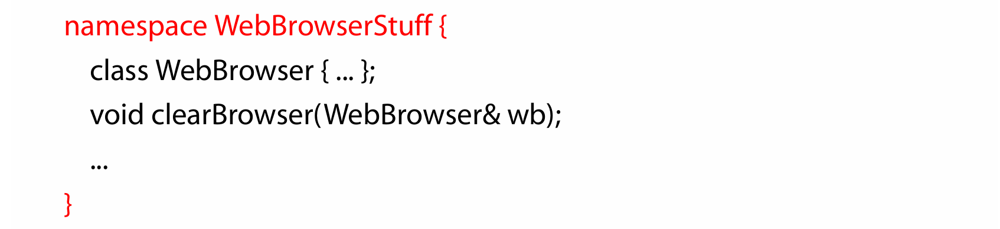
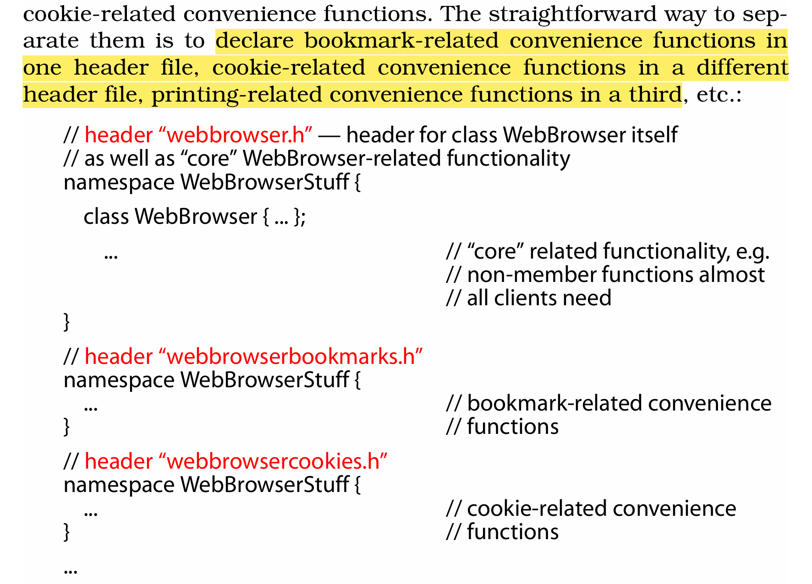
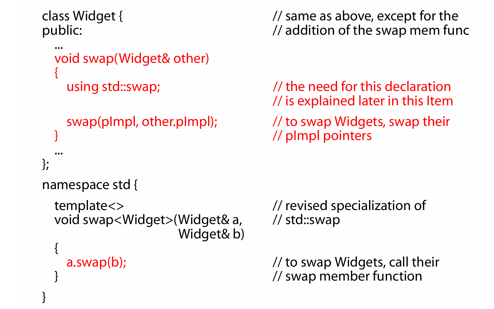
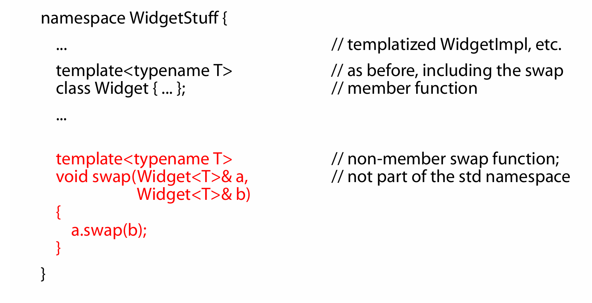
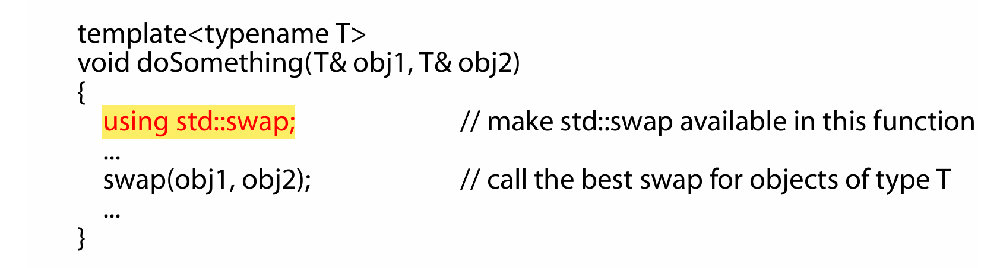
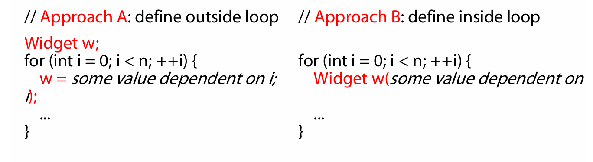
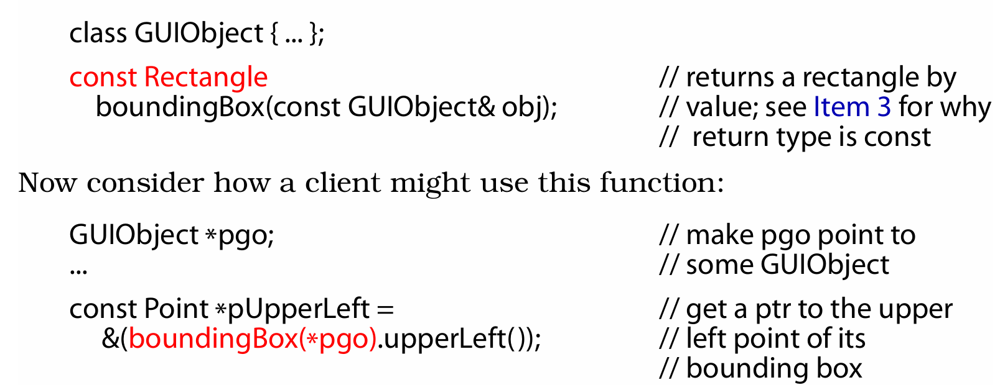

# Effective C++

## Chapter 1: Accustoming Yourself to C++

### Item 1: View C++ as a federation of languages

### Item 2: Prefer consts, enums, and inlines to #defines

- For simple constants, prefer `const` objects or `enum`s to #defines.
- For function-like macros, prefer `inline` functions to #defines.

### Item 3: Use `const` whenever possible

- Declaring something const helps compilers detect **usage errors**. const can be applied to objects at any scope, to function parameters and return types, and to member functions as a whole.
- Compilers enforce bitwise constness, but you should program using **logical constness**.
- When const and non-const member functions have essentially identical implementations, code duplication can be avoided by having the **non-const version call the const version**. 

1. **mutable** 的功能
   修饰类的**非静态**数据成员，使其可以在 const 成员函数或 const 对象中修改。
   通常用于需要在逻辑上 "不改变对象状态" 的场景，例如**缓存**、统计数据等。

### Item 4: Make sure that objects are initialized before they're used

- Manually initialize objects of **built-in type**, because C++ only some times initializes them itself.
- In a constructor, prefer use of the **member initialization list** to **assignment** inside the body of the constructor. List data members in the initialization list in the same order they're declared in the class.
- Avoid initialization order problems across translation units( the relative order of initialization of non
  local static objects defined in different translation units is undefined ) by **replacing non-local static objects with local static objects**.

1. Included are _global objects_, _objects defined at namespace scope_, _objects declared static inside classes_, _objects declared static inside functions_, and _objects declared static at file scope_. Static objects inside functions are known as **local static objects** (because they’re local to a function), and the other kinds of static objects are known as **non-local static objects**.
2. 将 non-local static objects 移动到他们自己的**引用返回函数(reference-returning functions)**中, 像 Singleton 模式一样, 但需要保证多线程安全，在程序的单线程启动部分手动调用所有引用返回函数
   

## Chapter 2: Constructors, Destructors, and Assignment Operators

### Item 5: Know what functions C++ silently writes and calls

- Compilers may implicitly generate a class's **default constructor**, **copy constructor**, **copy assignment operator**, and **destructor**.

1. 默认拷贝构造函数的参数类型是 `const ClassName&` `ClassName(const ClassName& other)`
2. 如果一个类的成员变量是:

   1. const (只能在初始化时赋值，无法通过拷贝或赋值修改)
   2. 引用类型 (必须在初始化时绑定到某个对象，不能重新绑定到另一个对象)
   3. 对象拥有指针成员并使用了浅拷贝(如 int\*裸指针)
   4. 独占资源管理对象（如 std::unique_ptr, 文件句柄、互斥锁、网络连接等）

   则编译器**无法生成默认拷贝构造函数**

   解决：显式定义拷贝构造函数

   1. ```cpp
      class MyClass {
      public:
         const int value; // const 成员变量

         MyClass(int v) : value(v) {}

         // 手动定义拷贝构造函数
         MyClass(const MyClass& other) : value(other.value) {}
      };
      ```

   2. ```cpp
       class MyClass {
       public:
          int& ref; // 引用类型成员
        MyClass(int& r) : ref(r) {}

        // 手动定义拷贝构造函数
        MyClass(const MyClass& other) : ref(other.ref) {}
      };
      ```

### Item 6: Explicitly disallow the use of compiler-generated functions you do not want

- 使用 `= delete` 明确禁用编译器生成的函数

### Item 7: Declare destructors virtual in polymorphic base classes

- **Polymorphic base classes** should declare **virtual destructors**. If a class has any virtual functions, it should have a virtual destructor.
- Classes not designed to be base classes or not designed to be used **polymorphically** should not declare virtual destructors.

### ? Item 8: Prevent exceptions from leaving destructors

- **Destructors should never emit exceptions**. If functions called in a destructor may throw, the destructor should catch any exceptions, then **swallow** them or **terminate** the program.
- If class clients need to be able to react to exceptions thrown during an operation, the class should provide a regular (i.e., non-destructor) function that performs the operation.

### Item 9: Never call virtual functions during construction or destruction

- Don't call virtual functions during construction or destruction, because such calls will **never go to a more derived class** than that of the currently executing constructor or destructor.
  

### Item 10: Have assignment operators return a reference to `*this`

- Have assignment operators return a reference to **\*this**.

### Item 11: Handle assignment to self in `operator=`

- Make sure operator= is well-behaved when an object is assigned to itself. Techniques include **comparing addresses** of source and target objects, **careful statement ordering**, and **copy-and-swap** (优点：异常安全保证。即使 `swap` 操作或复制构造函数在过程中抛出异常，程序仍然可以保持一致性，原始对象（\*this）不会丢失数据).
  
- Make sure that any function operating on more than one object behaves correctly if two or more of the objects are the **same**.

### Item 12: Copy all parts of an object

- Copying functions should be sure to copy **all** of an object’s data members and all of its **base class parts**.
  
- Don’t try to implement one of the copying functions in terms of the other. Instead, put common functionality in a third function that both call. (不要用拷贝构造函数调用赋值操作符，反之亦然)

## Chapter 3: Resource Management

### Item 13: Use objects to manage resources

- To prevent resource leaks, use **RAII(Resource Acquisition Is Initialization)** objects that acquire resources in their constructors and release them in their destructors.
- Two commonly useful RAII classes are shared_ptr and unique_str. shared_ptr is usually the better choice, because its behavior when copied is intuitive. Copying(`move()`) an unique_str sets it to null.

1. shared_ptr 被**拷贝**时，它的引用计数会增加； 被**移动**时，所有权会从一个 shared_ptr 转移到另一个 shared_ptr，引用计数不变。

### Item 14: Think carefully about copying behavior in resource-managing classes

- Copying an RAII object entails copying the resource it manages, so the copying behavior of the resource determines the copying behavior of the RAII object.
- Common RAII class copying behaviors are **disallowing copying** and **performing reference counting**, but other behaviors are possible(**Copy the underlying resource**; **Transfer ownership of the underlying resource**).

### Item 15: Provide access to raw resources in resource-managing classes

- APIs often require access to raw resources, so each RAII class should offer a way to get at the resource it manages.
- Access may be via **explicit** conversion or **implicit** conversion. In general, explicit conversion is safer, but implicit conversion is more convenient for clients.
  
  

### Item 16: Use the same form in corresponding uses of new and delete

- If you use [] in a new expression, you must use [] in the corresponding delete expression. If you don’t use [] in a new expression, you mustn’t use [] in the corresponding delete expression.

### Item 17: Store newed objects in smart pointers in standalone statements

- Store newed objects in smart pointers in **standalone statements**. Failure to do this can lead to subtle resource leaks when _exceptions are thrown_.

  ```cpp
  processWidget(std::tr1::shared_ptr<Widget>(new Widget), priority()); // 错误示例


  std::tr1::shared_ptr<Widget> pw(new Widget); // store newed object
                                               // in a smart pointer in a
                                               // standalone statement
  processWidget(pw, priority());               // this call won’t leak
  ```

1. 在 C++11 及更高版本中，优先使用 `std::make_shared` 和 `std::make_unique`，它们将内存分配和智能指针构造合并为一个操作, 更安全和简洁。

## Chapter 4: Designs and Declarations

### Item 18: Make interfaces easy to use correctly and hard to use incorrectly

- Ways to facilitate correct use include consistency in interfaces and behavioral compatibility with **built-in types**.
- Ways to prevent errors include creating new types, restricting operations on types, constraining object values, and eliminating client resource management responsibilities.
- tr1::shared_ptr supports custom deleters. This prevents the cross-DLL problem, can be used to automatically unlock mutexes (see [Item 14](#item-14-think-carefully-about-copying-behavior-in-resource-managing-classes)), etc.

### Item 19: Treat class design as type design

考虑以下问题：

1. 对象的**创建**和**销毁**
2. 对象**初始化**与**赋值**的区别
3. 对象是否**按值传递**
4. 类成员的**合法值**限制
5. 类的**继承**关系
6. **类型转换**的规则
   - 需要决定是否允许类型转换。如果允许**隐式转换**，可以实现**类型转换函数**或**单参数构造函数**；
   - 如果只允许**显式转换**，需要避免隐式转换的实现。
7. 类的运算符和函数
   [](#item-23-prefer-non-member-non-friend-functions-to-member-functions)[](#item-24-declare-non-member-functions-when-type-conversions-should-apply-to-all-parameters)
8. 禁止的标准函数
   - 如拷贝构造函数或赋值运算符
9. 成员的访问权限
   - 需要确定哪些成员是公有的、受保护的或私有的，以及哪些类或函数应该是友元。还需要考虑是否将一个类嵌套在另一个类中
10. 类的"未声明接口"
    - 类的设计不仅包括显式接口，还包括隐式的性能保证、异常安全性和资源使用（如锁和动态内存）等方面的约束。
11. 类的通用性
    - 考虑是否需要将类设计为**模板**类，以便支持不同的数据类型。
12. 是否需要定义新类型
    - 如果只是为了扩展现有类的功能，可能不需要定义新的派生类，而是可以通过定义非成员函数或模板来实现目标。

### Item 20: Prefer pass-by-reference-to-const to pass-by-value

- Prefer **pass-by-reference-to-const** over pass-by-value. It's typically more efficient and it avoids the **slicing problem**.
- The rule doesn't apply to _built-in types_ and _STL iterator_ and _function object types_. For them, **pass-by-value** is usually appropriate.

1. Slice problem: When a derived class object is passed by value to a function that takes a base class object, the derived class part of the object is sliced off.
   
   
2. Many objects — most STL containers among them — contain little more than a pointer, but copying such objects entails copying everything they point to. That can be very expensive.
3. some compilers refuse to put **objects** consisting of only a double into a register, even though they happily place **naked doubles** there on a regular basis. When that kind of thing happens, you can be better off passing such objects by reference, because compilers will certainly put pointers (the implementation of references) into registers.

### Item 21: Don't try to return a reference when you must return an object

- Never return a pointer or reference to a **_local stack_** object, a reference to a **_heap-allocated_** object, or a pointer or reference to a **_local static_** object if there is a chance that more than one such object will be needed. (Item 4 provides an example of a design where returning a reference to a local static is reasonable, at least in single-threaded environments.)
  

1. 上面的例子中`friend const Rational operator*`加`const`的原因是防止返回值被修改。
2. 加`friend`的原因是需要**访问私有成员**且运算符需支持**左右操作数的隐式转换**(若`operator*`是成员函数（如`Rational::operator*`），则只有右操作数支持隐式类型转换，左操作数必须是`Rational`类型。)

### Item 22: Declare data members private

- Declare data members private. It gives clients **syntactically uniform access to data**, affords **fine-grained access control**, allows **invariants** to be enforced, and offers class authors **implementation flexibility**. (if the data members are changed, an **_unknowably large amount of client code is broken_**.)
- **protected** is no more encapsulated than **public**.

### Item 23: Prefer non-member non-friend **functions** to member functions

- Prefer non-member non-friend functions to member functions. Doing so increases **encapsulation**, **packaging flexibility**, and **functional extensibility**.
  

  1. **Encapsulation**: A **member function** (which can access not only the private data of a class, but also private functions, enums, typedefs, etc.) and a **non-member non-friend function** (which can access none of these things);
     - Make clearBrowser a **static member function of some utility class** in languages where all functions must be in classes (e.g., Eiffel, Java, C#, etc.)
     - In C++, a more natural approach would be to make clearBrowser a **non-member function in the same namespace** as WebBrowser.
       
  2. **Partitioning functionality** in this way is not possible when it comes from a class’s member functions, because a class must be defined in its entirety; it can’t be split into pieces(several header files);
  3. **Extensibility**: If a WebBrowser client decides to write convenience functions related to downloading images, he or she just needs to create a **new header file containing the declarations of those functions in the WebBrowserStuff namespace**.

1. As a general rule, most clients will be interested in only some of these sets of convenience functions.
   

### Item 24: Declare non-member functions when type conversions should apply to all parameters

- If you need **type conversions** on all parameters to a function (including the one that would otherwise be pointed to by the `this` pointer), the function must be a non-member(但不一定是`friend`，尽量别是).

### Item 25: Consider support for a non-throwing `swap`

- Provide a swap member function when `std::swap` would be inefficient for your type. Make sure your swap doesn’t throw **exceptions**.
- If you offer a **member** swap, also offer a **non-member** swap that calls the member. For classes (not templates), **specialize** `std::swap`, too.
- When calling swap, employ a using **declaration for std::swap**, then call swap without namespace qualification.
- It’s fine to **totally specialize** std templates for user-defined types, but never try to add something completely new to `std`.

1. 完全特化（total template specialization）
   (不适用于类模板)
   
   It’s okay to totally specialize templates in std, but it’s **not** okay to **add new templates** (or classes or functions or anything else) to std.
2. When you want to “partially specialize” a function template, the usual approach is to simply add an **overload**.（不推荐向`std`中添加内容）
   支持类和类模板。
3. 非成员+ADL
   (推荐，需要 write both a **non-member** version(调用 public 的 **member** function) in the same namespace as your class and a **specialization** of std::swap)
   
   调用 `swap(a, b)` 时，编译器会查找 a 和 b 类型所在命名空间中的 swap, 通过 `using std::swap` 确保在没有用户定义 swap 时使用 `std::swap`
   

   1. **ADL**(Argument-Dependent Lookup，参数依赖查找): 当调用一个函数时，编译器不仅会在当前作用域和全局作用域中查找该函数，还会在**函数参数类型所属的命名空间**中查找。
      - 如果参数类型是类类型，则关联命名空间包括：
        - 类所在的命名空间。
        - 类的直接和间接基类所在的命名空间。
      - 如果参数类型是模板实例化（如 `Widget<T>`），则关联命名空间包括：
        - 模板参数类型所在的命名空间。
        - 模板本身所在的命名空间。

## Chapter 5: Implementations

### Item 26: Postpone variable definitions as long as possible

- **Postpone variable definitions** as long as possible. It increases program clarity and improves program efficiency.(postpone the definition until you have **initialization arguments** for it)

1. 一般选择 Approach B 更好
   - Approach A: 1 constructor + 1 destructor + n assignments.
   - Approach B: n constructors + n destructors.

### Item 27: Minimize casting

- **Avoid casts** whenever practical, especially `dynamic_casts` in performance-sensitive code. If a design requires casting, try to develop a cast-free alternative.
- When casting is necessary, try to **hide it** inside a function. Clients can then call the function instead of putting casts in their own code.
- Prefer **C++-style casts** to old-style casts. They are easier to see, and they are more specific about what they do.

### Item 28: Avoid returning "handles" to object internals

- Avoid returning handles (references, pointers, or iterators) to object internals. Not returning handles increases **encapsulation**, helps **const** member functions act const, and minimizes the creation of **dangling handle**s.
  
  **boundingBox’s return value — temp — will be destroyed, and that will indirectly lead to the destruction of temp’s Points**

1. 不能通过 const 引用来调用非 const 成员函数

### Item 29: Strive for exception-safe code

- Exception-safe functions **leak no resources** and allow **no data structures to become corrupted**, even when exceptions are thrown. Such functions offer the **basic**, **strong**, or **nothrow** guarantees.
- The strong guarantee can often be implemented via **copy-and-swap**, but the strong guarantee is not practical for all functions.
- A function can usually offer a guarantee no stronger than the weakest guarantee of the functions it calls.

1. **Basic guarantee**: If an exception is thrown, the program is in a **valid state** and all invariants are intact, but the exact state of the program may **not be predictable**.
2. **Strong guarantee**: If an exception is thrown, the program is in the **state it was in before the function was called**. No resources are leaked, and all invariants are intact.
3. **Nothrow guarantee**: The function will not throw an exception.
     
     
   

### Item 30: Understand the ins and outs of inline

- Limit most inlining to small, frequently called functions. This facilitates **debugging** and **binary upgradability**, minimizes potential **code bloat**, and maximizes the chances of greater program speed.
- Don’t declare function **templates** inline just because they appear in header files.

1. **Binary upgradability**: If a library implementer later decides to change `f`, all clients who’ve used `f` must **recompile**. This is often undesirable. On the other hand, if `f` is a non-inline function, a modification to `f` requires only that clients **relink**.
2. If an exception is thrown during **construction** of an object, any parts of the object that have already been fully **constructed** are **automatically destroyed**.
   
3. Compilers typically don’t perform inlining across calls through **function pointers**
4. Most compilers refuse to inline functions they deem too complicated (e.g., those that contain loops or are recursive), and all but the most trivial calls to virtual functions defy inlining.
