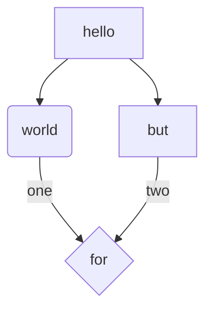
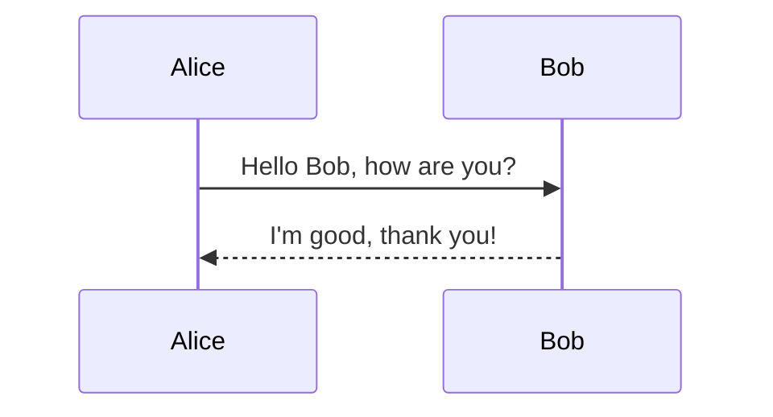
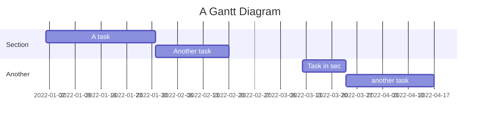

#### 表格
![[Pasted image 20240311143351.png]]

#### 流程图

```mermaid
graph TD;
    A[hello]-->B(world);
    A-->C[but];
    B-->|one| D[else];
    C-->|two| D{for};
```
#### 序列图

```mermaid
sequenceDiagram
    Alice->>Bob: Hello Bob, how are you?
    Bob-->>Alice: I'm good, thank you!
```
#### 甘特图

```mermaid
gantt
    title A Gantt Diagram
    dateFormat  YYYY-MM-DD
    section Section
    A task           :a1, 2022-01-01, 30d
    Another task     :after a1  , 20d
    section Another
    Task in sec      :2022-03-12  , 12d
    another task    : 24d
```
