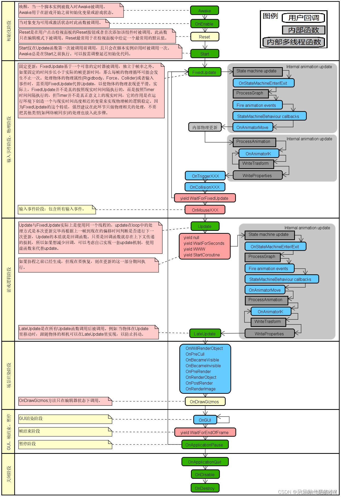

# Unity

## 生命周期

## 协程

### 简述协程的作用

在 Unity 中，协程是一种轻量级的线程，用于在单一线程上执行多个任务，实现异步等待和延迟执行等效果。协程不是取代线程，而是抽象于线程之上，同一时间只有一个协程拥有运行权，相当于单线程的能力。协程的执行基于迭代器，通过 `yield` 语句来实现暂停和恢复执行，从而更加灵活地控制协程的执行过程。

协程可以在不创建新线程的情况下实现异步等待和延迟执行，避免了线程切换和同步等问题，从而提高了程序的性能和效率。在 Unity 中，协程通常用于处理一些异步任务，比如等待一段时间、播放动画、加载资源等。协程的执行过程可以通过 `yield` 语句来控制，比如 `yield return new WaitForSeconds(5)`可以让协程等待 5 秒钟后再继续执行。此外，协程还可以通过 `yield return null` 等方式来控制协程的执行过程。

需要注意的是，协程并不是多线程，协程的执行是在主线程上进行的，因此协程中的操作不应该阻塞主线程的执行。如果协程需要执行一些耗时的操作，可以将其放到后台线程中执行，然后通过 `yield return null` 等方式来控制协程的执行过程。

在 Unity 中只有主线程才能访问 Unity3D 的对象、方法、组件。当主线程在执行一个对资源消耗很大的操作时，在这一帧我们的程序就会出现帧率下降，画面卡顿的现象!

那这个时候我们就可以利用协程来做这件事，因为协程是伴随着主线程运行的，主线程依旧可以丝滑轻松的工作，把脏活累活交给协程处理就好了！简单来说：协程是辅助主线程的操作，避免游戏卡顿。

### 简述协程的底层原理

- 协程是通过迭代器来实现功能的，通过关键字 `IEnumerator` 来定义一个迭代方法。
- `StartCoroutine` 接受到的是一个 `IEnumerator` ，这是个接口，并且是枚举器或迭代器的意思。
- `yield` 是 C#的一个关键字，也是一个语法糖，背后的原理会**生成一个类**，并且也是一个**枚举器**，而且不同于 `return`，`yield` 可以出现多次。
- `yield` 实际上就是返回一次结果，因为我们要一次一次枚举一个值出来，所以多个 `yield` 其实是个**状态模式**，第一个 `yield` 是状态 1，第二个`yield` 是状态 2，每次访问时会基于状态知道当前应该执行哪一个 `yield`，取得哪一个值。

从程序的角度讲，协程的核心就是**迭代器**。
想要定义一个协程方法有两个因素，第一：方法的返回值为 IEnumerator 。第二，方法中有 yield 关键字。
当代码满足以上两个条件时，此方法的执行就具有了迭代器的特质，其核心就是 `MoveNext` 方法。
方法内的内容将会被分成两部分：yield 之前的代码和 yield 之后的代码。yield 之前的代码会在第一次执行 MoveNext 时执行， yield 之后的代码会在第二次执行 MoveNext 方法时执行。
而在 Unity 中，MoveNext 的执行时机是以帧为单位的，无论你是设置了延迟时间，还是通过按钮调用 MoveNext，亦或是根本没有设置执行条件，Unity 都会在**每一帧的生命周期中判断当前帧是否满足当前协程所定义的条件**，一旦满足，当前帧就会抽出 CPU 时间执行你所定义的协程迭代器的 MoveNext。
注意，只要方法中有 yield 语句，那么方法的返回值就必须是 IEnumerator ，不然无法通过编译。

### 正在运行的脚本，隐藏物体与禁止脚本导致触发 OnDisable 时，Invoke 与 coroutine 是否正常运行？

- 只将脚本禁止：都会正常运行。
- 如果把物体直接隐藏：Invoke 正常运行，coroutine 不会正常运行。
  原因：因为游戏物体隐藏了，一切与游戏物体相关的脚本生命周期都会停止，协程自然也会停止 ；
  如果游戏对象没有隐藏，只是将脚本隐藏，游戏对象照样可以通过反射获取协程迭代器对象继续协程的执行。

## 网络

### TCP/IP 协议栈各个层次及分别的功能？

1. 网络接口层：这是协议栈的最低层，对应 OSI 的物理层和数据链路层，主要完成数据帧的实际发送和接收。
2. 网络层：处理分组在网络中的活动，例如路由选择和转发等，这一层主要包括 IP 协议、ARP、ICMP 协议等。
3. 传输层：主要功能是提供应用程序之间的通信，这一层主要是 TCP/UDP 协议。
4. 应用层：用来处理特定的应用，针对不同的应用提供了不同的协议，例如进行文件传输时用到的 FTP 协议，发送 email 用到的 SMTP 等。
